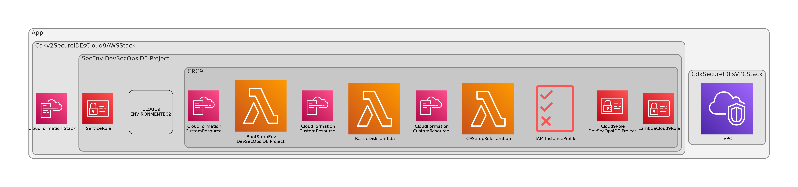

**Table of Contents** 

- [Hands On](#hands-on)
  - [Requirements](#requirements)
  - [AWS Services](#aws-services)
  - [Solution Overview](#solution-overview)
    - [Conditions](#conditions)
    - [User management](#user-management)
    - [Developer IAM role](#developer-iam-role)
    - [Step by Step](#step-by-step)
    - [Clean up](#clean-up)

# Cloud-native development with AWS – Part 1 – Secure IDEs Cloud9 Setup

AWS Cloud9 is the principal service that can help you to solve this challenge, **a cloud-based IDE that allows you to write, execute, and debug code through the web browser**. AWS Cloud9 contains pre-installed software and tools for language such as Python, Ruby, Go, PHP and others, AWS CLI, and **direct integration with services such as AWS Lambda and CodeCommit**. **Key features of AWS Cloud9 include an integrated code debugger, built-in terminal, collaborative chat and editing, and connectivity to any Linux server platform.**  To know more about these features, you can read  the service’s details.

## Solution Overview

<center>


Figure 1. Solution overview- Secure Cloud Native IDE

</center>

> Please visit https://dev.to/avelez For more! 

## How to

The `cdk.json` file tells the CDK Toolkit how to execute your app.

This project is set up like a standard Python project.  The initialization
process also creates a virtualenv within this project, stored under the `.venv`
directory.  To create the virtualenv it assumes that there is a `python3`
(or `python` for Windows) executable in your path with access to the `venv`
package. If for any reason the automatic creation of the virtualenv fails,
you can create the virtualenv manually.

To manually create a virtualenv on MacOS and Linux:

```
$ python3 -m venv .venv
```

After the init process completes and the virtualenv is created, you can use the following
step to activate your virtualenv.

```
$ source .venv/bin/activate
```

If you are a Windows platform, you would activate the virtualenv like this:

```
% .venv\Scripts\activate.bat
```

Once the virtualenv is activated, you can install the required dependencies.

```
$ pip install -r requirements.txt
```
## Code structure

The following diagram shows the code stacks and structure.



### Understand the project structure.
The CDK project has the following structure, as is usual the project properties are in `yaml` file in `project_configs` folder.
  

```commandline
├── app.py
├── cdk.context.json
├── cdk.json
├── cdk.out
├── __init__.py
├── project_configs
│   ├── environment_options
│   │   ├── environment_options_example.yaml
│   │   └── project_1
│   ├── environment_options_example.yaml
│   ├── helpers
│   │   ├── helper.py
│   │   ├── __init__.py
│   │   ├── project_configs.py
│   ├── images
│   │   ├── DevSecOps-labs-Cloud-native development with AWS-ArchOverview.png
│   │   └── diagram.png
│   ├── __init__.py
│       └── __init__.cpython-310.pyc
├── README.md
├── requirements-dev.txt
├── requirements.txt
├── source.bat
├── src
│   ├── cdkv2_secure_ides_c9_aws_stack.py
│   ├── __init__.py
│   ├── lib
│   │   ├── customs
│   │   ├── ides
│   │   ├── __init__.py
│   │   ├── cdkv2_secure_ides_c9_aws_stack.cpython-310.pyc
│   └── stacks
│       ├── __init__.py
│       ├── network
└── tests
    ├── __init__.py
    └── unit
        ├── __init__.py
        └── test_cdkv2_secure_ides_c9_aws_stack.py

```


### Modify project properties 
For this setup the project properties are in `project_configs/environment_options/project_1/environment_options.yaml`, the code is created for deployment and manage many environments in different accounts you can setup each one creating a folder  like `project_configs/environment_options/<project_name>/environment_options.yaml`,  and setup an environment variable for synth and deploy. Also, you can create many environments for the same account in the `environment_props` block.

```bash
export props_paths='../environment_options/project_1/environment_options.yaml'
```

Create a environment options file like: 

```yaml
project_name: 'CloudNativeIDEs'

# DevSecOps Account Environment setup
devsecops_account: "123456789012"
devsecops_region: "us-east-1"


network_definitions:
  create_vpc: True
  vpc_cidr: "192.168.0.0/16"
  max_azs: 2
  nat_gateways: 0
  subnet_configuration:
      - name: "public"
        cidr_mask : 24
        subnet_type : "public"
      - name: "ides"
        cidr_mask : 24
        subnet_type : "isolate"

environment_props:
  - environment_name: 'DevSecOpsIDE-Project'
    description: "DevSecOps IDE Blog"
    instance_size: 't3.small'
    automatic_stop_time_minutes: 30
    resize_volume: "True"
    ebs_volume_size: '17'
    bootstrap_environment: "True"
    bootstrap_commands: 'bootstrap.sh'
    subnet_type: 'public'
    owner_arn: 'arn:aws:sts:: 123456789012:assumed-role/AWSReservedSSO_LabxlDevSecOpsRW_a4790b6a3d6c520a/DevSecOpsAdm'

    codecommit_repos:
      - 'MyREPO'

# Tags definitions align with enterprise instructions
tags:
  - key: 'Project'
    value: 'SecureIdes'
  - key: 'Stack'
    value: 'SecureIdes'
  - key: 'Environment'
    value: 'Prod'


```
In this example you can find the network definitions and environment definitions blocks. You can enable or disable custom actions and use codecommit repositories, if you don want clone codecommit repositories comment the lines.
The boostrap_commands parameter indicates the path of bootstrap shell script file. For example:

```bash
#!/bin/bash

sudo yum update -y
sudo yum upgrade -y
sudo yum install -y yum-utils
echo "bootstrapping environment"> /home/ec2-user/environment/bootstrap-file.txt

```

> This file is in the same project folder, use with precaution and scripts certificated for correct deployment.

### Synth code and deploy.

Verify the stacks. 
```bash
$ cdk ls
CdkSecureIDEsVPCStack
Cdkv2SecureIDEsCloud9AWSStack
```

At this point you can now synthesize the CloudFormation template for this code.

```
$ cdk synth
```

To add additional dependencies, for example other CDK libraries, just add
them to your `setup.py` file and rerun the `pip install -r requirements.txt`
command.

## Useful commands

 * `cdk ls`          list all stacks in the app
 * `cdk synth`       emits the synthesized CloudFormation template
 * `cdk deploy`      deploy this stack to your default AWS account/region
 * `cdk diff`        compare deployed stack with current state
 * `cdk docs`        open CDK documentation

Enjoy!

